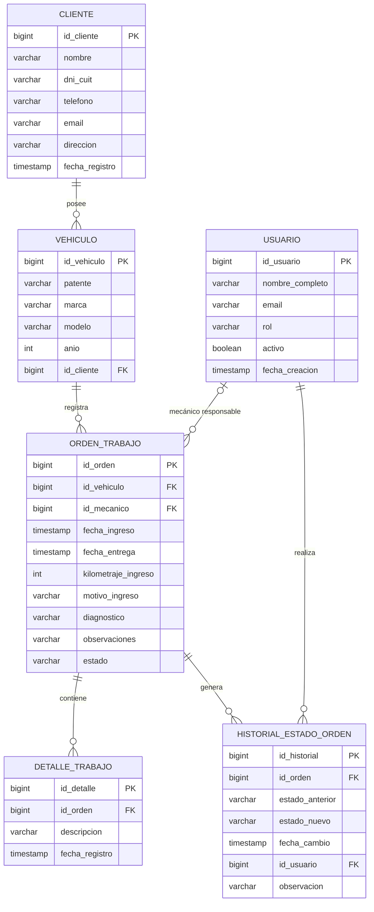

# 2.ª Entrega — Arquitectura y Módulos

**Proyecto:** MiTaller — Sistema Web de Gestión y Trazabilidad para Taller Mecánico
**Carrera:** Tecnicatura Universitaria en Programación a Distancia — UTN
**Integrantes:** Augusto Matías Cúneo Brouwer de Koning y Nicolás Azcuy
**Tutora:** Prof. María Candela Grosso
**Fecha:** 27/09/2026

---

## 1. Objetivo de la entrega

Esta segunda entrega presenta los dos elementos requeridos para la instancia de **Arquitectura y Módulos**:

1. el **esquema relacional de la base de datos** correspondiente al Producto Mínimo Viable de MiTaller;
2. el **listado de módulos a desarrollar**, con su responsabilidad y alcance.

Las decisiones mantienen el alcance definido en la primera entrega: el eje del sistema es la **trazabilidad de las órdenes de trabajo**, mientras que Turnos y Dashboard continúan como funcionalidades complementarias y no forman parte de los requisitos indispensables del MVP.

---

## 2. Arquitectura general

MiTaller utilizará una arquitectura cliente-servidor. El frontend se comunicará mediante HTTP y JSON con una API REST desarrollada con Spring Boot.

**Frontend:** HTML + CSS + TypeScript + Vite
**Backend:** Java 17 + Spring Boot
**Persistencia:** Spring Data JPA / Hibernate
**Base de datos:** H2
**Organización del backend:** Controller → Service → Repository

La capa **Service** concentrará la lógica de negocio, en particular la validación de los roles y las transiciones permitidas entre los estados de las órdenes de trabajo.

---

## 3. Esquema de base de datos

Se adopta un **modelo relacional** implementado sobre **H2**, consistente con el stack definido para el proyecto.

El modelo relacional resulta adecuado porque el dominio presenta entidades claramente identificables y relaciones que deben conservar integridad referencial: clientes, vehículos, usuarios, órdenes de trabajo, detalles de trabajo e historial de estados.

El script SQL completo y compatible con H2 se encuentra en:

`database/schema.sql`

### 3.1. Entidades principales

El MVP se compone de seis entidades principales.

#### Usuario

Representa a las personas que operan el sistema.

| Campo | Tipo lógico | Restricción principal | Finalidad |
|---|---|---|---|
| id_usuario | BIGINT | PK | Identificador del usuario. |
| nombre_completo | VARCHAR | NOT NULL | Nombre del operador. |
| email | VARCHAR | UNIQUE | Correo de contacto. |
| rol | VARCHAR | NOT NULL, valor controlado | `RECEPCION_ADMINISTRACION` o `MECANICO`. |
| activo | BOOLEAN | NOT NULL | Indica si el usuario está habilitado. |
| fecha_creacion | TIMESTAMP | NOT NULL | Fecha de alta. |

El rol se modela como un valor controlado dentro de Usuario y no como una entidad independiente.

#### Cliente

Representa a las personas vinculadas con los vehículos atendidos.

| Campo | Tipo lógico | Restricción principal | Finalidad |
|---|---|---|---|
| id_cliente | BIGINT | PK | Identificador del cliente. |
| nombre | VARCHAR | NOT NULL | Nombre y apellido o razón social. |
| dni_cuit | VARCHAR | UNIQUE | Documento o CUIT, si corresponde. |
| telefono | VARCHAR | Opcional | Teléfono de contacto. |
| email | VARCHAR | Opcional | Correo electrónico. |
| direccion | VARCHAR | Opcional | Domicilio. |
| fecha_registro | TIMESTAMP | NOT NULL | Fecha de alta. |

#### Vehículo

Representa cada unidad atendida por el taller.

| Campo | Tipo lógico | Restricción principal | Finalidad |
|---|---|---|---|
| id_vehiculo | BIGINT | PK | Identificador del vehículo. |
| patente | VARCHAR | NOT NULL, UNIQUE | Dominio del vehículo. |
| marca | VARCHAR | NOT NULL | Marca. |
| modelo | VARCHAR | NOT NULL | Modelo. |
| anio | INT | Opcional | Año de fabricación. |
| id_cliente | BIGINT | FK, NOT NULL | Cliente al que pertenece. |

Cada vehículo pertenece a un único cliente.

#### Orden de Trabajo

Es la entidad central de MiTaller y representa una intervención sobre un vehículo.

| Campo | Tipo lógico | Restricción principal | Finalidad |
|---|---|---|---|
| id_orden | BIGINT | PK | Identificador de la orden. |
| id_vehiculo | BIGINT | FK, NOT NULL | Vehículo intervenido. |
| id_mecanico | BIGINT | FK, opcional al crear | Mecánico responsable. |
| fecha_ingreso | TIMESTAMP | NOT NULL | Fecha y hora de ingreso. |
| fecha_entrega | TIMESTAMP | Opcional | Fecha de entrega efectiva. |
| kilometraje_ingreso | INT | NOT NULL | Kilometraje de la intervención. |
| motivo_ingreso | VARCHAR | NOT NULL | Motivo informado al ingresar. |
| diagnostico | VARCHAR | Opcional | Diagnóstico técnico. |
| observaciones | VARCHAR | Opcional | Observaciones de la intervención. |
| estado | VARCHAR | NOT NULL, valor controlado | Estado actual de la orden. |

Una orden puede crearse sin mecánico mientras permanezca en `RECIBIDO`. Antes de pasar a `EN_DIAGNOSTICO` debe tener un único usuario con rol `MECANICO` asignado. Esta condición se validará mediante lógica de negocio.

#### Detalle de Trabajo

Registra individualmente las tareas realizadas dentro de una orden.

| Campo | Tipo lógico | Restricción principal | Finalidad |
|---|---|---|---|
| id_detalle | BIGINT | PK | Identificador del detalle. |
| id_orden | BIGINT | FK, NOT NULL | Orden a la que pertenece. |
| descripcion | VARCHAR | NOT NULL | Descripción de la tarea realizada. |
| fecha_registro | TIMESTAMP | NOT NULL | Fecha de registración. |

Una orden puede no tener detalles al momento de su creación y acumular varios a medida que avanza la reparación.

#### Historial de Estado de la Orden

Conserva la trazabilidad temporal de las transiciones de una orden.

| Campo | Tipo lógico | Restricción principal | Finalidad |
|---|---|---|---|
| id_historial | BIGINT | PK | Identificador del cambio. |
| id_orden | BIGINT | FK, NOT NULL | Orden modificada. |
| estado_anterior | VARCHAR | NOT NULL, valor controlado | Estado previo. |
| estado_nuevo | VARCHAR | NOT NULL, valor controlado | Estado posterior. |
| fecha_cambio | TIMESTAMP | NOT NULL | Fecha y hora de la transición. |
| id_usuario | BIGINT | FK, NOT NULL | Usuario responsable. |
| observacion | VARCHAR | Opcional | Comentario del cambio. |

La creación inicial de una orden en `RECIBIDO` no se considera una transición. El primer registro histórico se genera cuando la orden cambia desde `RECIBIDO` hacia otro estado.

### 3.2. Estados de la orden

Los valores permitidos son:

- `RECIBIDO`
- `EN_DIAGNOSTICO`
- `EN_REPARACION`
- `ESPERANDO_REPUESTO`
- `CONTROL_FINAL`
- `FINALIZADO`
- `ENTREGADO`

El flujo normal es:

**RECIBIDO → EN_DIAGNOSTICO → EN_REPARACION → CONTROL_FINAL → FINALIZADO → ENTREGADO**

Las transiciones permitidas para el MVP son:

| Origen | Destino | Responsable |
|---|---|---|
| RECIBIDO | EN_DIAGNOSTICO | Mecánico |
| EN_DIAGNOSTICO | EN_REPARACION | Mecánico |
| EN_DIAGNOSTICO | ESPERANDO_REPUESTO | Mecánico |
| EN_REPARACION | ESPERANDO_REPUESTO | Mecánico |
| ESPERANDO_REPUESTO | EN_REPARACION | Mecánico |
| EN_REPARACION | CONTROL_FINAL | Mecánico |
| CONTROL_FINAL | EN_REPARACION | Mecánico |
| CONTROL_FINAL | FINALIZADO | Mecánico |
| FINALIZADO | ENTREGADO | Recepción / Administración |

Estas transiciones se validarán en la capa Service. `ENTREGADO` será un estado terminal dentro del MVP.

### 3.3. Relaciones y cardinalidades

| Relación | Cardinalidad | Regla |
|---|---|---|
| Cliente — Vehículo | 1 a 0..N | Un cliente puede tener cero o varios vehículos; cada vehículo pertenece a un cliente. |
| Vehículo — Orden de Trabajo | 1 a 0..N | Un vehículo puede tener cero o varias órdenes; cada orden pertenece a un vehículo. |
| Usuario Mecánico — Orden de Trabajo | 0..N a 0..1 | Un mecánico puede tener varias órdenes; una orden puede no tener mecánico sólo mientras permanece en `RECIBIDO`. |
| Orden de Trabajo — Detalle de Trabajo | 1 a 0..N | Una orden puede tener cero o múltiples detalles; cada detalle pertenece a una orden. |
| Orden de Trabajo — Historial de Estado | 1 a 0..N | Una orden puede no tener transiciones al crearse y luego acumular múltiples registros. |
| Usuario — Historial de Estado | 1 a 0..N | Cada cambio identifica exactamente a un usuario; un usuario puede realizar múltiples cambios. |

### 3.4. Diagrama Entidad-Relación

---

## 4. Módulos a desarrollar

Los módulos se definieron a partir de las funcionalidades indispensables del MVP. La división funcional no implica que cada módulo se convierta en un servicio o aplicación independiente; todos formarán parte de la misma aplicación MiTaller.

| Módulo | Responsabilidad principal | Entidades / datos involucrados | MVP |
|---|---|---|:---:|
| Usuarios y Roles | Identificar a las personas que operan el sistema y diferenciar Recepción/Administración de Mecánico. | Usuario, rol | Sí |
| Clientes | Registrar, consultar y modificar clientes. | Cliente | Sí |
| Vehículos | Registrar vehículos, asociarlos a clientes y consultar sus intervenciones. | Vehículo, Cliente, Orden de Trabajo | Sí |
| Órdenes de Trabajo | Crear y consultar órdenes, registrar datos de ingreso, asignar mecánico, diagnóstico, observaciones y estado actual. | Orden de Trabajo, Vehículo, Usuario | Sí |
| Detalles de Trabajo | Registrar las tareas concretas efectuadas durante una intervención. | Detalle de Trabajo, Orden de Trabajo | Sí |
| Trazabilidad e Historial | Controlar las transiciones permitidas y conservar cada cambio con fecha, hora y usuario responsable. | Historial de Estado, Orden de Trabajo, Usuario | Sí |
| Turnos | Organizar ingresos previamente programados. | Se definirá sólo si se implementa. | No |
| Dashboard | Mostrar información operativa resumida para Recepción/Administración. | Consultas sobre órdenes y estados existentes. | No |

### 4.1. Dependencias funcionales principales

El circuito central puede resumirse así:

**Cliente → Vehículo → Orden de Trabajo → Detalles de Trabajo / Historial de Estado**

El módulo de Usuarios participa transversalmente en la asignación del mecánico responsable y en la identificación de quién realiza cada transición.

El historial general de un vehículo no constituye un módulo de persistencia independiente: se obtiene consultando cronológicamente las órdenes asociadas a la unidad.

### 4.2. Funcionalidades complementarias

**Turnos** y **Dashboard** permanecen fuera de la ruta crítica del MVP. Podrán incorporarse una vez que Usuarios, Clientes, Vehículos, Órdenes de Trabajo, Detalles y Trazabilidad estén implementados, probados y estables.

---

## 5. Correspondencia entre arquitectura, datos y módulos

La solución mantiene una única aplicación con responsabilidades separadas:

- el **frontend** presenta las operaciones correspondientes a cada rol;
- los **Controllers** exponen la API REST;
- los **Services** aplican reglas de negocio, permisos funcionales y transiciones;
- los **Repositories** gestionan el acceso a H2 mediante Spring Data JPA;
- el **modelo relacional** conserva las relaciones y la trazabilidad necesarias para el MVP.

De esta manera, el esquema de base de datos y los módulos propuestos derivan directamente del alcance aprobado en la primera entrega y constituyen la base para iniciar la implementación posterior.
